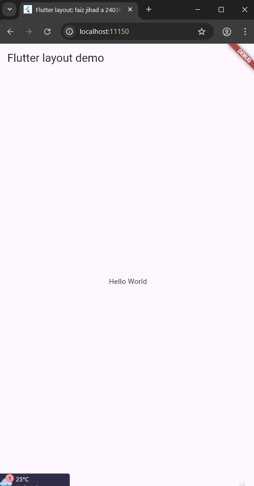
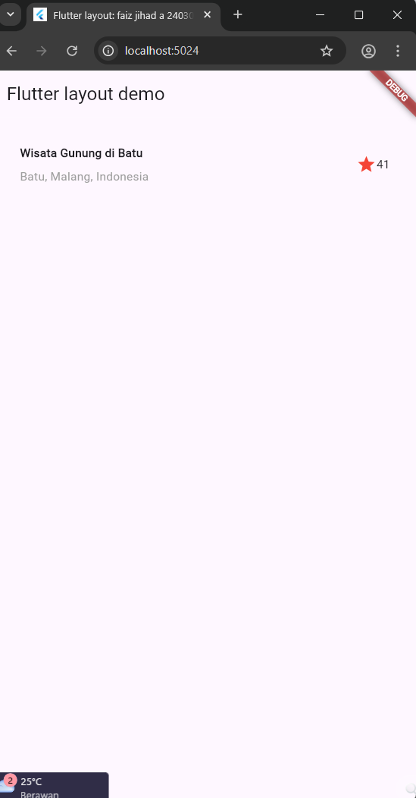
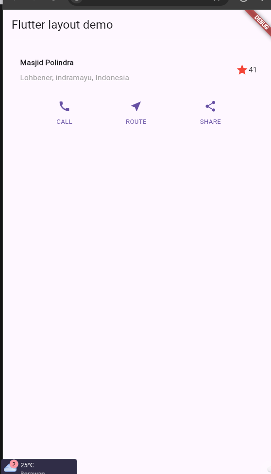
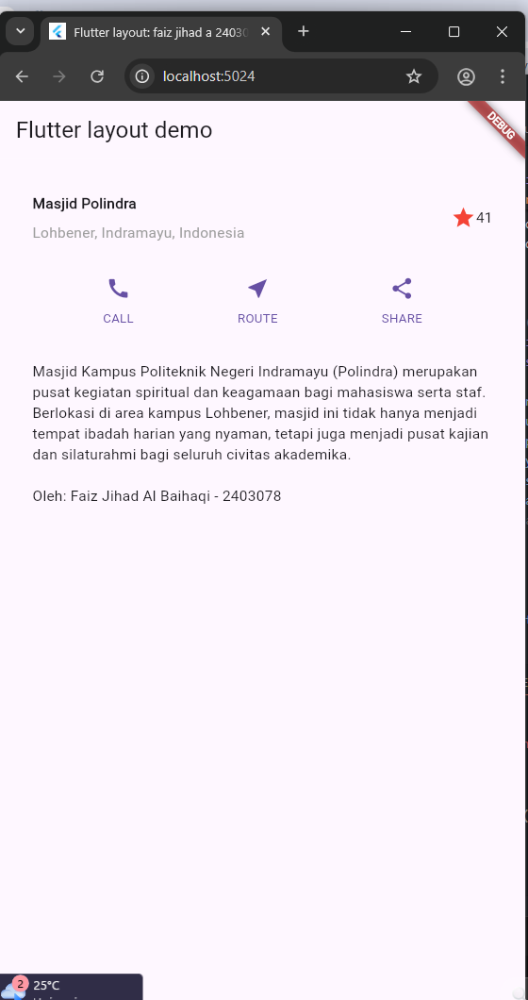
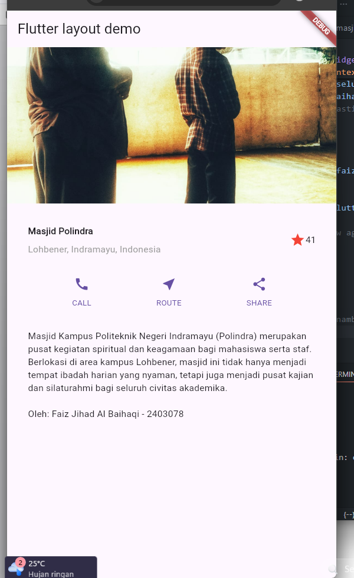

# Layout dan Navigasi - Praktikum PPB

**Identitas Mahasiswa:**
- **Nama:** Faiz Jihad Al Baihaqi
- **NIM:** 2403078

---

## 📸 Bukti Praktikum

Berikut adalah dokumentasi hasil pengerjaan langkah-langkah praktikum pembuatan layout aplikasi menggunakan Flutter:

### 1. Langkah 1 (Setup Awal)

### 2. Title Section (Row & Column)

### 3. Button Section (Row of Columns)

### 4. Text Section

### 5. Image Section

---
*Dokumentasi ini di-generate untuk memenuhi tugas mata kuliah Pemrograman Perangkat Bergerak (PPB).* 